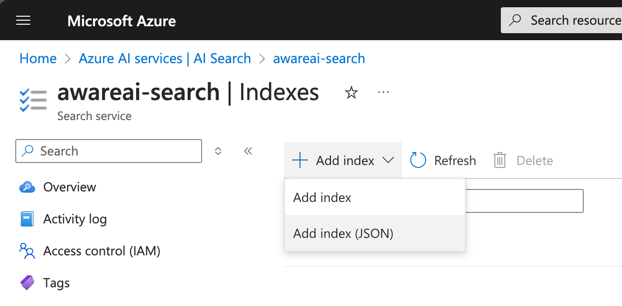

## Installation instructions

A full deployment can take roughly 30min.

### 1. Entra ID App Registrations

### 2. Template deployment

### 3. Azure AI Search index setup



* Navigate to your Azure AI Search service in the Azure Portal
* Select Indexes
* Select Add Index > Add Index (JSON) and paste the full json files below
* Repeat for each index

```json
{
  "name": "chatmemory",
  "defaultScoringProfile": null,
  "fields": [
    {
      "name": "id",
      "type": "Edm.String",
      "searchable": true,
      "filterable": true,
      "retrievable": true,
      "sortable": false,
      "facetable": false,
      "key": true,
      "indexAnalyzer": null,
      "searchAnalyzer": null,
      "analyzer": null,
      "normalizer": null,
      "dimensions": null,
      "vectorSearchProfile": null,
      "synonymMaps": []
    },
    {
      "name": "tags",
      "type": "Collection(Edm.String)",
      "searchable": false,
      "filterable": true,
      "retrievable": true,
      "sortable": false,
      "facetable": false,
      "key": false,
      "indexAnalyzer": null,
      "searchAnalyzer": null,
      "analyzer": null,
      "normalizer": null,
      "dimensions": null,
      "vectorSearchProfile": null,
      "synonymMaps": []
    },
    {
      "name": "payload",
      "type": "Edm.String",
      "searchable": true,
      "filterable": false,
      "retrievable": true,
      "sortable": false,
      "facetable": false,
      "key": false,
      "indexAnalyzer": null,
      "searchAnalyzer": null,
      "analyzer": null,
      "normalizer": null,
      "dimensions": null,
      "vectorSearchProfile": null,
      "synonymMaps": []
    },
    {
      "name": "embedding",
      "type": "Collection(Edm.Single)",
      "searchable": true,
      "filterable": false,
      "retrievable": true,
      "sortable": false,
      "facetable": false,
      "key": false,
      "indexAnalyzer": null,
      "searchAnalyzer": null,
      "analyzer": null,
      "normalizer": null,
      "dimensions": 1536,
      "vectorSearchProfile": "KMDefaultProfile",
      "synonymMaps": []
    }
  ],
  "scoringProfiles": [],
  "corsOptions": null,
  "suggesters": [],
  "analyzers": [],
  "normalizers": [],
  "tokenizers": [],
  "tokenFilters": [],
  "charFilters": [],
  "encryptionKey": null,
  "similarity": {
    "@odata.type": "#Microsoft.Azure.Search.BM25Similarity",
    "k1": null,
    "b": null
  },
  "semantic": null,
  "vectorSearch": {
    "algorithms": [
      {
        "name": "KMDefaultAlgorithm",
        "kind": "hnsw",
        "hnswParameters": {
          "metric": "cosine",
          "m": 4,
          "efConstruction": 400,
          "efSearch": 500
        },
        "exhaustiveKnnParameters": null
      }
    ],
    "profiles": [
      {
        "name": "KMDefaultProfile",
        "algorithm": "KMDefaultAlgorithm",
        "vectorizer": null
      }
    ],
    "vectorizers": []
  }
}
```

```json
{
  "name": "global-documents",
  "defaultScoringProfile": null,
  "fields": [
    {
      "name": "Id",
      "type": "Edm.String",
      "searchable": false,
      "filterable": false,
      "retrievable": true,
      "sortable": false,
      "facetable": false,
      "key": true,
      "indexAnalyzer": null,
      "searchAnalyzer": null,
      "analyzer": null,
      "normalizer": null,
      "dimensions": null,
      "vectorSearchProfile": null,
      "synonymMaps": []
    },
    {
      "name": "Embedding",
      "type": "Collection(Edm.Single)",
      "searchable": true,
      "filterable": false,
      "retrievable": true,
      "sortable": false,
      "facetable": false,
      "key": false,
      "indexAnalyzer": null,
      "searchAnalyzer": null,
      "analyzer": null,
      "normalizer": null,
      "dimensions": 1536,
      "vectorSearchProfile": "searchProfile",
      "synonymMaps": []
    },
    {
      "name": "Text",
      "type": "Edm.String",
      "searchable": true,
      "filterable": true,
      "retrievable": true,
      "sortable": true,
      "facetable": true,
      "key": false,
      "indexAnalyzer": null,
      "searchAnalyzer": null,
      "analyzer": null,
      "normalizer": null,
      "dimensions": null,
      "vectorSearchProfile": null,
      "synonymMaps": []
    },
    {
      "name": "Description",
      "type": "Edm.String",
      "searchable": false,
      "filterable": true,
      "retrievable": true,
      "sortable": false,
      "facetable": true,
      "key": false,
      "indexAnalyzer": null,
      "searchAnalyzer": null,
      "analyzer": null,
      "normalizer": null,
      "dimensions": null,
      "vectorSearchProfile": null,
      "synonymMaps": []
    },
    {
      "name": "AdditionalMetadata",
      "type": "Edm.String",
      "searchable": false,
      "filterable": true,
      "retrievable": true,
      "sortable": false,
      "facetable": true,
      "key": false,
      "indexAnalyzer": null,
      "searchAnalyzer": null,
      "analyzer": null,
      "normalizer": null,
      "dimensions": null,
      "vectorSearchProfile": null,
      "synonymMaps": []
    },
    {
      "name": "ExternalSourceName",
      "type": "Edm.String",
      "searchable": false,
      "filterable": true,
      "retrievable": true,
      "sortable": false,
      "facetable": true,
      "key": false,
      "indexAnalyzer": null,
      "searchAnalyzer": null,
      "analyzer": null,
      "normalizer": null,
      "dimensions": null,
      "vectorSearchProfile": null,
      "synonymMaps": []
    },
    {
      "name": "IsReference",
      "type": "Edm.Boolean",
      "searchable": false,
      "filterable": true,
      "retrievable": true,
      "sortable": false,
      "facetable": true,
      "key": false,
      "indexAnalyzer": null,
      "searchAnalyzer": null,
      "analyzer": null,
      "normalizer": null,
      "dimensions": null,
      "vectorSearchProfile": null,
      "synonymMaps": []
    }
  ],
  "scoringProfiles": [],
  "corsOptions": null,
  "suggesters": [],
  "analyzers": [],
  "normalizers": [],
  "tokenizers": [],
  "tokenFilters": [],
  "charFilters": [],
  "encryptionKey": null,
  "similarity": {
    "@odata.type": "#Microsoft.Azure.Search.BM25Similarity",
    "k1": null,
    "b": null
  },
  "semantic": null,
  "vectorSearch": {
    "algorithms": [
      {
        "name": "searchAlgorithm",
        "kind": "hnsw",
        "hnswParameters": {
          "metric": "cosine",
          "m": 4,
          "efConstruction": 400,
          "efSearch": 500
        },
        "exhaustiveKnnParameters": null
      }
    ],
    "profiles": [
      {
        "name": "searchProfile",
        "algorithm": "searchAlgorithm",
        "vectorizer": null
      }
    ],
    "vectorizers": []
  }
}
```

### 4. Theming, branding & lockdown